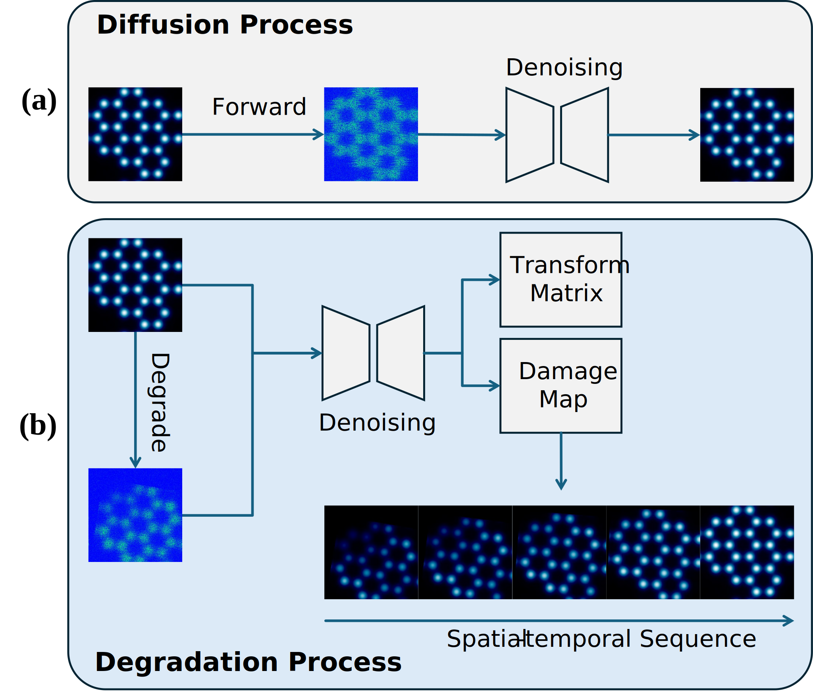
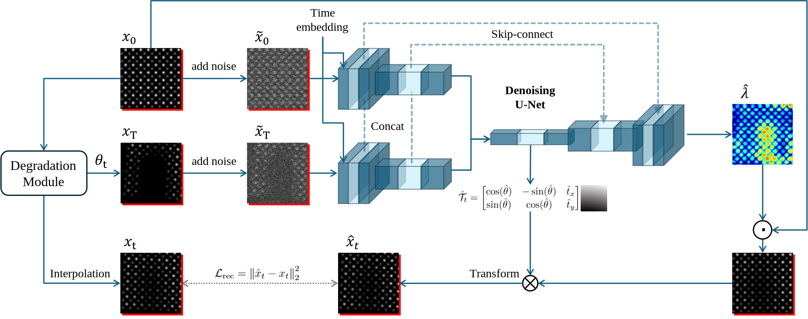
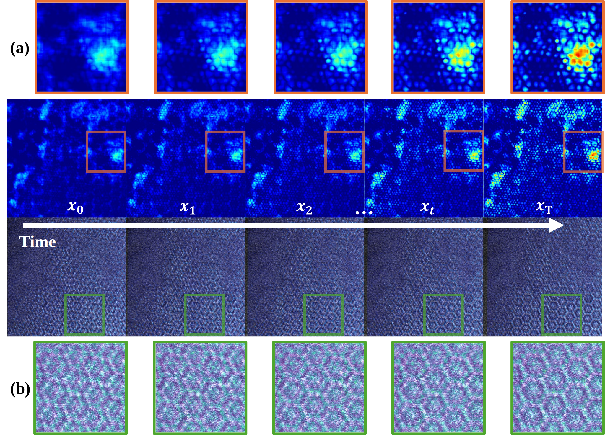

# AtomDiffuser: Time-Aware Degradation Modeling for Drift and Beam Damage in STEM Imaging

Our paper is accepted by 
<a href="https://sites.google.com/view/cv4ms-iccv-2025" target="_blank">ICCV 2025 CV4MS Workshop</a>

See our paper at the ICCV 2025: 
<a href="./exp/Poster_hao9_ICCV_2025.pdf" target="_blank">ICCV 2025 Poster</a> 
/ 
<a href="https://openaccess.thecvf.com/content/ICCV2025W/CV4MS/html/Wang_AtomDiffuser_Time-Aware_Degradation_Modeling_for_Drift_and_Beam_Damage_in_ICCVW_2025_paper.html" target="_blank">Paper</a>


## Project Overview
Scanning transmission electron microscopy (STEM) plays a critical role in modern materials science, enabling direct imaging of atomic structures and their evolution under external interferences. However, interpreting time-resolved STEM data remains challenging due to two entangled degradation effects: spatial drift caused by mechanical and thermal instabilities, and beam-induced signal loss resulting from radiation damage. These factors distort both geometry and intensity in complex, temporally correlated ways, making it difficult for existing methods to explicitly separate their effects or model material dynamics at atomic resolution.

<div align="center">
    
</div>

In this work, we present AtomDiffuser, a time-aware degradation modeling framework that disentangles sample drift and radiometric attenuation by predicting an affine transformation and a spatially varying decay map between any two STEM frames. Unlike traditional denoising or registration pipelines, our method leverages degradation as a physically heuristic, temporally conditioned process, enabling interpretable structural evolutions across time. Trained on synthetic degradation processes, AtomDiffuser also generalizes well to real-world cryo-STEM data. It further supports high-resolution degradation inference and drift alignment, offering tools for visualizing and quantifying degradation patterns that correlate with radiation-induced atomic instabilities.
<br> 


## Quick Tutorial

1. Run `main_test.py` as a demo to show the proposed method from the paper.
Go to [test](test) to check the outputs <br>

2. To train the model, first, please download `TEMImageNet` dataset from: [https://github.com/xinhuolin/TEM-ImageNet-v1.3](https://github.com/xinhuolin/TEM-ImageNet-v1.3) and reset the `data_folder` to your dataset folder. (For example, /dataset/TEMImageNet/) <br>
Run `main_train.py` to train the model on the `TEMImageNet`. <br>
Go to [exp](output) to check the training process and results <br>

We will update more details later according to the request. Please contact us anytime if you have questions.


## Dataset

- **TEMImageNet:** Download from [https://sites.google.com/view/temimagenet/home](https://sites.google.com/view/temimagenet/home)

---


## Key Features

- **Sample Drifting Estimation:** Estimate the transform matrix based on frame xt and xt+1.
- **Atom Degradation Map:** Generate an intensity map that estimates the atom degradation at the pixel level.

## Methodology

<div align="center">
    
</div>

**Degradation Process:**
While classical diffusion models have shown strong performance in generative and denoising tasks by learning to reverse a stochastic corruption process, they are less suited for modeling physically driven phenomena such as drift or beam damage. 
However, this formulation is limited in its ability to incorporate interpretable, structured degradation signals such as rigid motion, as DDPMs are primarily designed for noise removal rather than physical factor estimation.
<br>
In contrast, deterministic degradation models, such as Cold Diffusion, replace the stochastic noise process with a physically interpretable degradation process.
This formulation preserves temporal consistency and structural semantics while aligning more naturally with real-world degradation patterns, allowing the degraded state x_t to be computed directly from any time step t, which is consistent with the classical DDPM.


## Experimental Results

- **High-Quality:** Pixel-level estimation of atom degradation.
  

- **Explicity:** Output the estimated transform matrix between frames explicitly.
  

- **Accuracy:** Give an accurate overall degradation intensity of the sample.
  


See our project page for more information & updates:
<a href="https://github.com/AIS-Clemson/atom_diffuser" target="_blank">AIS-Clemson/AtomDiffuser</a>
 


 
### Acknowledgements:
Please cite our work if you find this project helpful.
```bibtex
@InProceedings{Wang_2025_ICCV,
    author    = {Wang, Hao and Zheng, Hongkui and He, Kai and Razi, Abolfazl},
    title     = {AtomDiffuser: Time-Aware Degradation Modeling for Drift and Beam Damage in STEM Imaging},
    booktitle = {Proceedings of the IEEE/CVF International Conference on Computer Vision (ICCV) Workshops},
    month     = {October},
    year      = {2025},
    pages     = {3631-3640}
}
```

<br>
<br>
<br>


<br>
<br>
